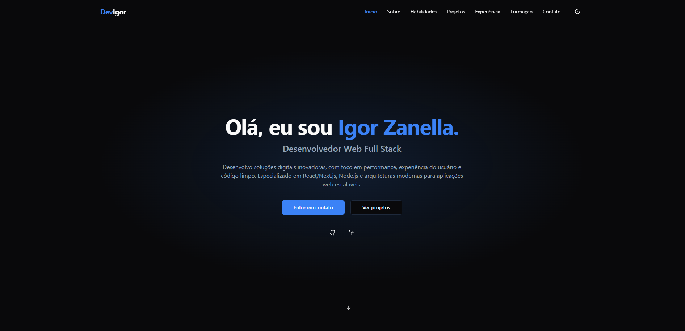

# 🌐 Portfólio | Igor Zanella

Este é meu portfólio pessoal desenvolvido com **Next.js**. O projeto apresenta minha trajetória profissional, habilidades técnicas, projetos, formação acadêmica e formas de contato.

---

## 📸 Demonstração



---

## 🛠️ Tecnologias Utilizadas

- **Next.js** — Framework React
- **TypeScript** — Tipagem estática para maior segurança
- **Tailwind CSS** — Estilização rápida e responsiva
- **Framer Motion** — Animações suaves
- **Shadcn/UI** — Componentes acessíveis e personalizáveis
- **Lucide Icons** — Ícones modernos via SVG

---

## 📂 Estrutura das Seções

- **Início**: Apresentação pessoal
- **Sobre mim**: Breve biografia e botão para download do CV em PDF.
- **Habilidades Técnicas**: Stacks separadas por categoria com destaque visual
- **Projetos**: Cards com animações, filtro por tipo e modal com detalhes
- **Experiência**: Timeline interativa com cards detalhados
- **Formação & Certificações**: Formação acadêmica e cursos agrupados por ano
- **Contato**: Canais para comunicação com botões de copiar e ícones sociais

---

## 🚀 Como Rodar o Projeto

### Pré-requisitos

- Node.js v18.x ou superior

### Passos

Clone o repositório e localize o projeto:

```bash
git clone https://github.com/ZanellaIgor/portfolio.git
cd portfolio
```

2. Instale as dependêcias com yarn ou npm

3. Rode o projeto:

```bash
npm run dev
# or
yarn dev
# or
pnpm dev
# or
bun dev
```
